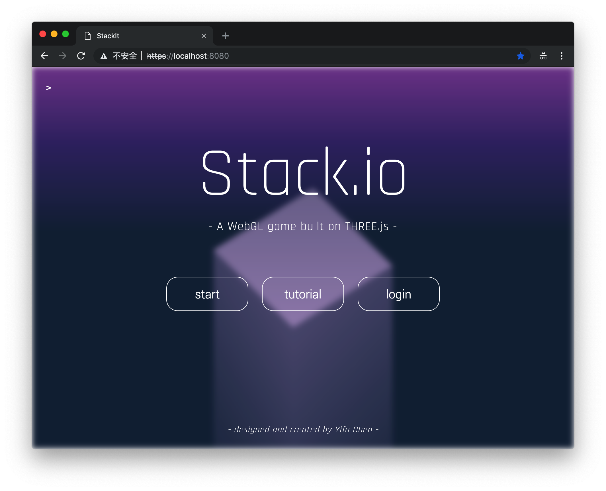

# **Stack.io**

> A WebGL game built on THREE.js and React
>
> This was a small project (version 1.0) I initiated for my computer graphics course. The inspiration comes from a mobil game that i played a lot when several years ago, and I wonder if I can create it with `THREE.js`. Version 1.0 is functional, but is totally not maintainable. So for version 2.0, the project is completely rewritten, with modern web dev tools like `webpack`, `node.js`, `React` and `Redux`, etc. Hope you enjoyed the game!:sunglasses:
>
> - [ENTER GAME HERE(1.0)](https://acw101.github.io/StackIt)
>
> - Version 2.0 coming soon:
>
>   Integration: `React.js` and `redux`
>
>   Backend: `Firebase` - handle user login and data storage

## Game Rules

The goal is to stack up blocks as high as possible. Be careful! If the new brick is not landing perfectly on the top of stack, the excessive portion out of top brick's border will disappear! If you totally miss the top brick, game over.

## Frameworks and Libraries

**React**

**Redux**

**THREE.js & Physijs**

This is the cornerstone for the game itself, and it's a powerful tool for desgining WebGL comtent with ease.

**Firebase**

Firebase offers clean and simple APIs to persist data, and deploy web apps. And it also offers other useful features like user login and authentication.

